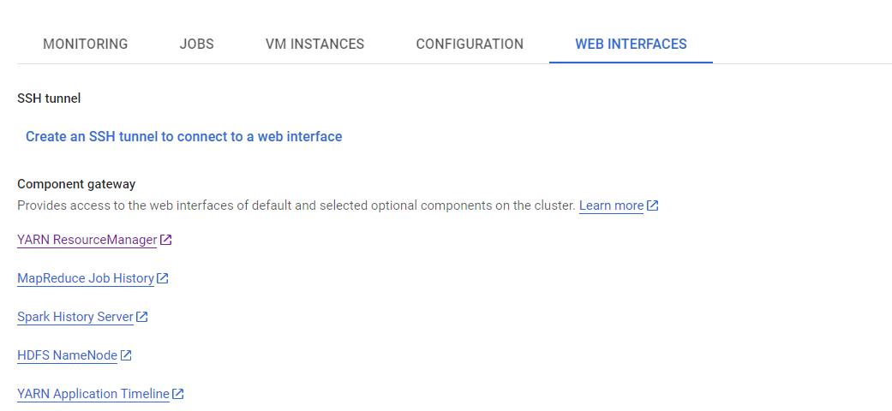
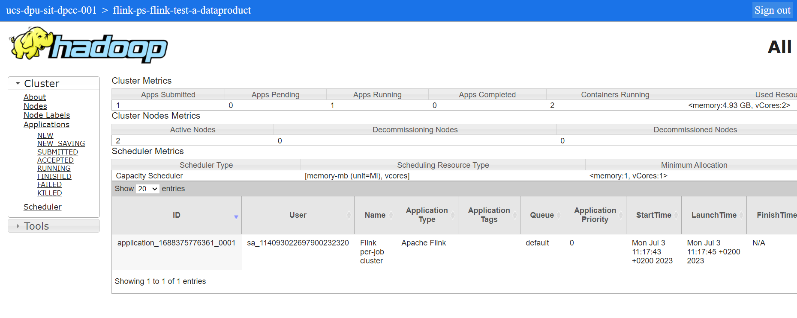
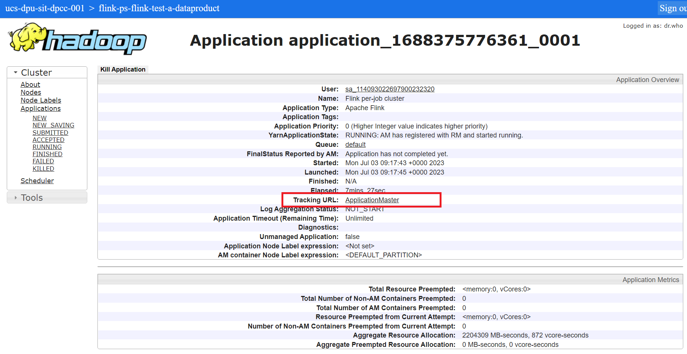

# Flink Job Lifecycle

This document outlines the general schema of the component lifecycle and the key steps required to deploy the component.

## Lifecycle

1. ### Create a Component

   Once you have met all the prerequisites, you are ready to proceed with creating the component. Follow the steps
   outlined in the wizard and refer to the [Descriptor Page](descriptor.md) for clarification on the required fields.
   Upon completing the component creation, a folder named *"mesh_your_component_name"* will be generated in BitBucket,
   containing an example of a Flink application.

   > IMPORTANT: It is crucial not to alter the folder structure, as the provisioner relies on it.

2. ### Develop the Job

   Clone the repository to your local machine and begin the development of your application. Once you have completed the
   development, you can push the code to Git, which will trigger
   the [Jenkins pipeline](https://jenkins.devops.internal.unicreditgroup.eu/job/DPU/). If everything proceeds well, then
   the artifact will be published on [Artifactory](https://artifactory.devops.internal.unicreditgroup.eu/).

   > NOTE: For the initial pipeline activation, you must trigger it manually. To do so, please follow the steps outlined
   in [Tips](tips.md#trigger-the-jenkins-pipeline).

   ***Versioning***

   It is important to note that there are two types of versions for this component: **Component version** and **Artifact
   version**.

    - **Component version** in `catalog-info.yaml` under `">specs>mesh>version"` refers to the general component
      version. This can be thought of as the catalog-info version. Any changes made to the catalog-info from the version
      already deployed require an update to this version. Missing to do this will result in the provisioner to ignore
      the deployment of the job in Dataproc Cluster.
    - **Artifact version** in `catalog-info.yaml` under `">specs>mesh>specific>artifact>version"` refers to the version
      of the artifact. During component deployment, any version from those already published on Artifactory can be
      chosen. While it is possible to refer to older artifacts, it is highly recommended to stay aligned with the most
      recent version.

   > NOTE: Artifact version is also mentioned in the `flink-app/pom.xml`: this is where the artifact version is defined.
   It represents the true version of your application during the build process.
   > This version refers to the artifact that will be published on Artifactory.
   > It is **VERY IMPORTANT** to maintain alignment among this version and the one of the artifact version.

3. ### Validation

   At this stage, if the artifact is ready on Artifactory, you can validate the Data Product by initiating a test
   through the Witboost UI, accessible via the control panel. The validation process includes:

    - Verifying that the artifact referenced in `catalog-info.yaml` is correctly present on Artifactory.
    - Validating the configurations of the Flink Job, such as the presence of the cluster in the descriptor, as well as
      correct definition of the catalog-info fields.

4. ### Deployment

   Once you have successfully passed all validation steps, you can proceed to `commit` your Data Product and then
   `deploy` it. Deploying the Data Product involves several steps:

    - Uploading the artifact to the bucket specified by the `GCS Storage Area` component of the
      `Flink Dataproc Cluster`, which is provided as a dependency.
    - Uploading artifact to the Dataproc cluster
    - Running the Flink application

   ATTENTION! THIS STEP TAKES FEW MINUTES TO COMPLETE. ITS DURATION DEPENDS ON THE SPEED OF THE DATAPROC SERVICES.

5. ### Testing and Troubleshooting

   To monitor your job:

- First go the Dataproc page on GCP. In the tab `Cluster` choose the cluster of your Data Product.

- Then click `Web Interfaces`

- Then click `YARN ResourceManager`

- Choose the job and on this page you can find all the logs for your application. To see the Flink Web Interface click
  `ApplicationMaster` on the row `Tracking URL`

6. ### Undeploy

   When the component is unregistered or the Data Product is undeployed the Flink Provisioner:

    - Removes the component folder from the GCS
    - Triggers savepoints for the related Flink Job on Dataproc Cluster (NB: this is the reason why savepoints folder is
      outside the component folder)
    - Kills the Job in Cluster
