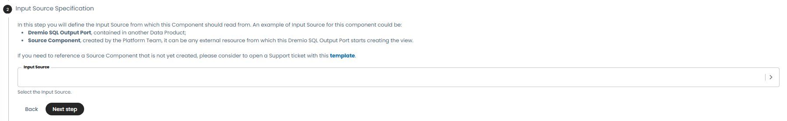
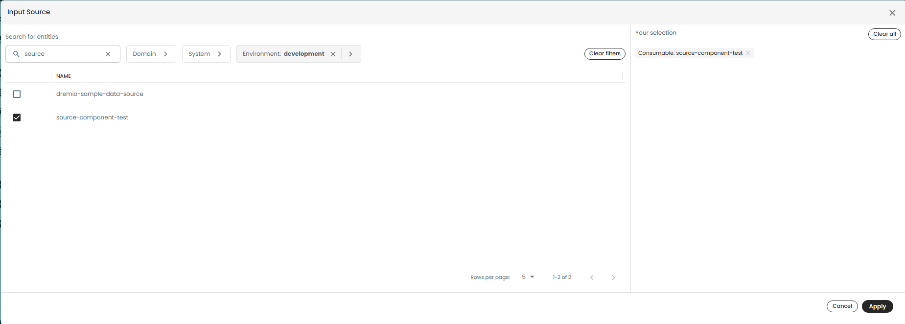
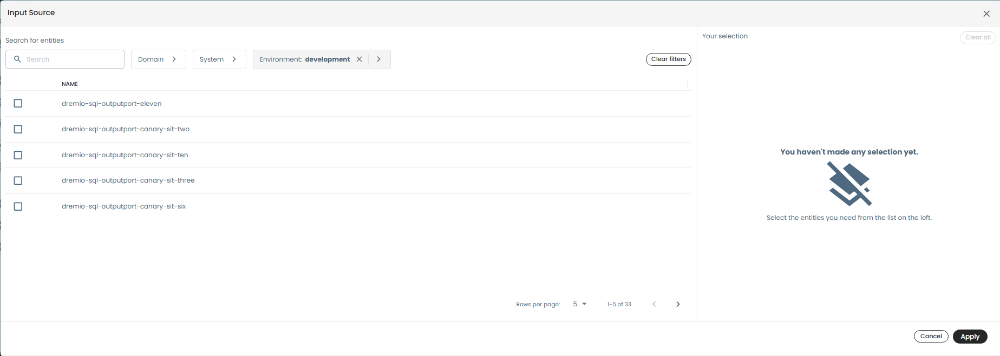

# Input Source Entities

With the new version of this Template Wizard, we introduced a particular field called **Input Source**. This field
enables you to declare the entities (a.k.a. __data sources__) from which this Workload starts to create process data.

Right now, you can select the following component types: **Output Port** and **Source Components**.

## Output Port Components

If you want this Workload to read from another Output Port you need to:

- Define/build the Output Port which is read. It can be defined either in the same Data Product or in another one.
- Deploy it. It needs to be deployed to be effective in this field.

## Source Components

If you want this Workload to read from an external source, you should request a Source Component creation.

For creating it just follow this [guide](https://confluence.internal.unicredit.eu/x/AU29Gg);

### Source Systems

Each __Source Component__ belongs to a **Source System**. This last is like a Data product but only available for Source
Components, so it is a container used to group Source Components.

The Source System is also created by the Platform Team by opening a support ticket.

In the following sections, you can see a utility for filtering Source Components on the basis of its Source System.

## Example Scenarios

### Source Component

Suppose you want to create a Workload that reads from an Oracle Database that is not registered inside Witboost. The
procedure is the following:

1. Open this Workload template
2. Fill all the fields until you get to **Input Source specification** step
   
3. Click on **Input Source** field and a view will open
   
4. You can filter the Input Source you want by "Domain" or "System". In particular, every Input Source can have a domain
   and a system of reference. This kind of information will be given to you as soon as the support ticket you will open
   in the next step is processed.
5. If you cannot find the Input Source in the above view, you can open a Support Ticket to the Platform Team by
   following the [template](https://confluence.internal.unicredit.eu/x/AU29Gg)

After this, you will be able to complete your Workload creation.

### Output Port

Suppose you want to create a Workload that reads from a GCS Output Port. The procedure is the following:

1. Open this Workload template
2. Fill all the fields until you get to **Input Source specification** step
   
3. Click on **Input Source** field and a view will open
   
4. You can filter the Input Source you want by "Domain" or "System". In particular, every Input Source can have a domain
   and a system of reference. In case of an Output Port, you already know this kind of information since "System" is the
   Data Product containing this Output Port, while Domain is the Data Product domain.
5. If you cannot find the Input Source in the above view. You must simply deploy the target Output Port before creating
   this Workload.

After this, you will be able to complete your Workload creation.