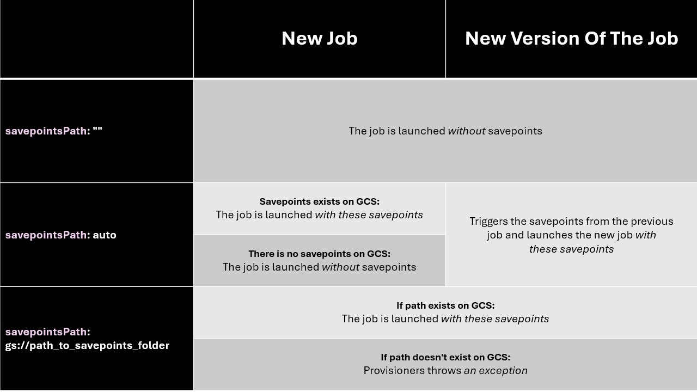

# Savepoints behaviour

This document outlines the description of the process of setting the savepoints for Flink Job.

More about Flink Savepoint refer to
the [official documentation](https://nightlies.apache.org/flink/flink-docs-master/docs/ops/state/savepoints/)

## savepointPath field

The user can set the savepoints path for the job. There are 3 possible values that can be set:

- "" (empty string)
- auto (force automatic behavior)
- gs://path_to_savepoint (the path to the folder with _metadata file of the savepoints)

The behaviour changes depending on the state of the newly deployed job, whether its

- New job: there is no running job for this workload on the Dataproc cluster
- New version of the job: there is running job with another version of the workload

> IMPORTANT: the folder with the savepoints can be found in the bucket provided as the dependency for the Dataproc
> cluster,
>
> in the folder of the Data Product major version, by going to the "savepoints/name_of_the_workload/dp_major"
>
> e.g gs://dp_name/dp_major/savepoints/workload_name/dp_major/

## Empty string

If user set the empty string, the job is launched without savepoints in both cases.

## Auto

If the job is a new job, the provisioner checks if there are savepoint for this component in the GCS folder, and assign
those to the new job, or run the job without savepoints if they are absent.

If the job is a new version, the savepoints are triggered for the previous version and set for the new job.

## GCS Path

> IMPORTANT: the folder with the savepoints can be found in the bucket provided as the dependency for the Dataproc
> cluster,
>
> in the folder of the Data Product major version, by going to the "savepoints/name_of_the_workload/dp_major"
>
> e.g gs://dp_name/dp_major/savepoints/workload_name/dp_major/

In both cases of new job and new version of the job, the savepoints assigned by user are set if they exist in GCS. If
the path doesn't exist the FlinkJobSubmissionException is launched.

## Summary

