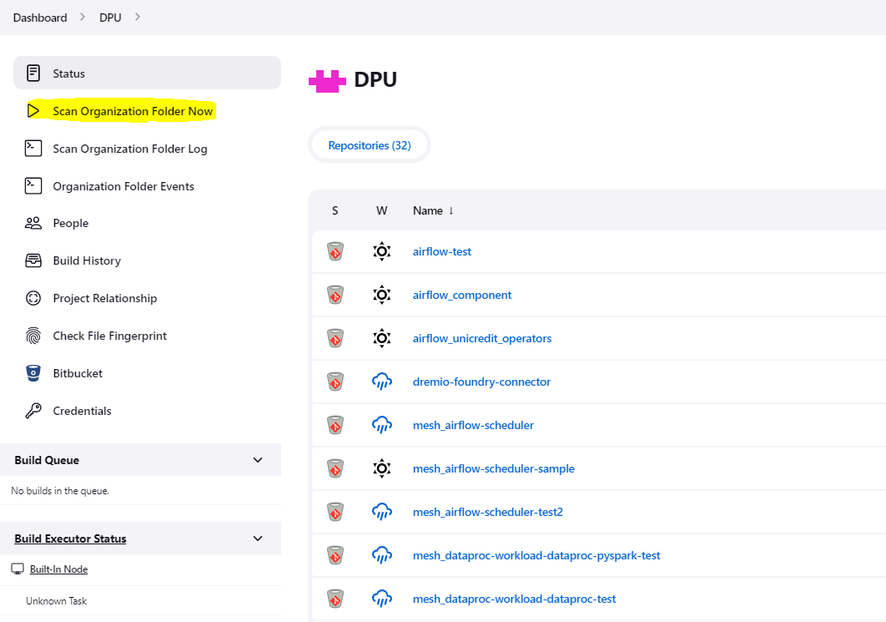

# Tips

This document describes tips and practices that may ease the development of the application.

## Trigger the Jenkins pipeline

The Jenkins pipeline is triggered automatically on push.
So after the push login in the [Jenkins UI](https://jenkins.devops.internal.unicreditgroup.eu/).

However, the first time you need to do it manually.
If you don't see yet your repository under *DPU project*, please press first the button _Scan Organization Folder Now_
on the left side of your screen:

After that you will be able to see your new Jenkins repository.

Then search for your component, choose your branch and press `Build Now`. It will trigger the pipeline.

## Versioning

It is important to note that there are two types of versions for this component: **Component version** and **Artifact
version**.

- **Component version** in `catalog-info.yaml` under `">specs>mesh>version"` pertains to the general component version.
  This can be thought of as the catalog-info version. Any changes made to the catalog-info with respect to the already
  deployed version necessitate an update to this version. Failure to do so will result in the provisioner failing to
  create a new workflow template.
- **Artifact version** in `catalog-info.yaml` under `">specs>mesh>specific>artifact>version"` refers to the version of
  the artifact. During component deployment, any version from those already published on the Artifactory can be chosen.
  While it is possible to refer to older artifacts, it is highly recommended to stay aligned with the most recent
  version.

> NOTE: Artifact version is also mentioned in the `flink-app/pom.xml`: this is where the artifact version is defined. It
> represents the true version of your application during the build process.
> This version refers to the artifact that will be published on Artifactory.
> It is **VERY IMPORTANT** to maintain alignment among this version and the one of the artifact version.
